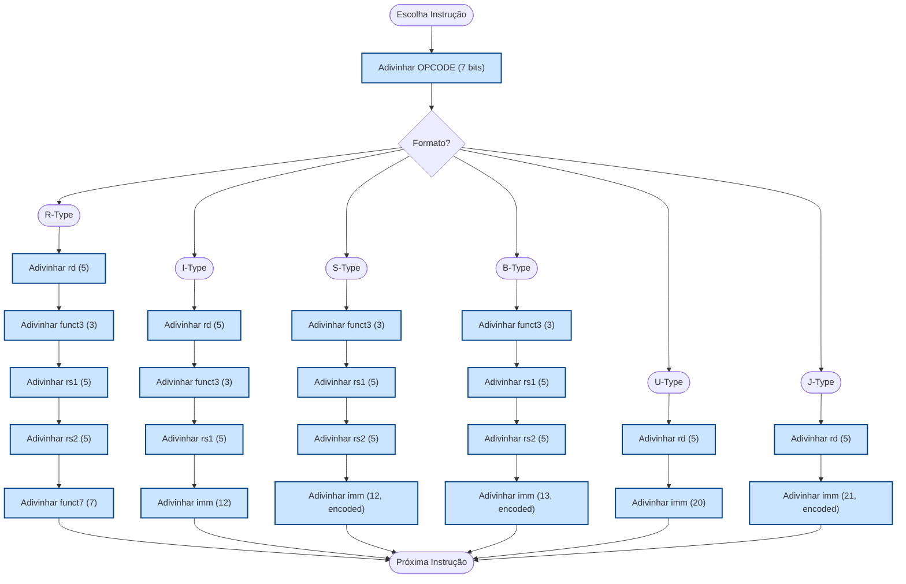

# Decodificando instruções do RISC-V 

O objetivo desta prática é construir um jogo para compreender a codificação de instruções e cálculos de endereço no RISC-V. Ele pode ser feito em qualquer linguagem de sua preferência, usando ou não o kit de FPGAs. A partir de um programa fornecido ou gerado aleatóriamente, o jogador precisa adivinhar partes das instruções ou endereços para ganhar pontos ou avançar no jogo. A seguir está um fluxo possível: 



> Todas as jogadas devem ser informadas em **binário** na console!

Procure usar programas com instruções bem diversas, por exemplo:

```asm 
_start:
    # R-type: registradores
    add     x5, x1, x2         # R: rd=x5, rs1=x1, rs2=x2, funct3=000, funct7=0000000
    xor     x4, x2, x3         # R: rd=x4, rs1=x2, rs2=x3, funct3=100, funct7=0000000
    # I-type (aritmético imediato)
    addi    x6, x5, 42         # I: rd=x6, rs1=x5, imm=42, funct3=000
    slli    x5, x6, 3          # I: rd=x5, rs1=x6, shamt=3, funct3=001
    # I-type (load)
    lw      x7, 64(x6)          # I: rd=x7, rs1=x6, imm=64, funct3=010
    lbu     x5, 32(x4)          # I: rd=x5, rs1=x4, imm=32, funct3=100
    # S-type: store
    sw      x7, 16(x5)         # S: rs1=x5, rs2=x7, imm=16, funct3=010
    sb      x6, 16(x2)         # S: rs1=x2, rs2=x6, imm=16, funct3=001
    # B-type: branch condicional
    beq     x5, x6, label      # B: rs1=x5, rs2=x6, imm=offset(label), funct3=000
    bne     x3, x4, label      # B: rs1=x3, rs2=x4, imm=offset(label), funct3=001
    # U-type: imediato alto
    lui     x8, 0xABCDE        # U: rd=x8, imm[31:12]=0xABCDE
    # J-type: salto
    jal     x1, end            # J: rd=x1 (ra), imm=offset(end)
label:
    addi    x9, x0, 7          # I: instrução após branch
end:
    nop                        # I-type: addi x0,x0,0
```

> Para garantir que as codificações estão corretas, seu programa **deve invocar o GCC** para gerá-la automaticamente. 

Depois você pode extrair os campos e gerar tabelas como a seguinte:

| Instr.           | Opcode  | rd | funct3 | rs1 | rs2 | funct7  | imm (decimal/hex)              |
| --------------- | ------- | -- | ------ | --- | --- | ------- | ------------------------------ |
| xor x5,x1,x2    | 0110011 | 5  | 100    | 1   | 2   | 0000000 | -                              |
| slli x6,x5,3    | 0010011 | 6  | 001    | 5   | -   | 0000000 | shamt=3                        |
| lbu x7,8(x6)    | 0000011 | 7  | 100    | 6   | -   | -       | 8                              |
| sb x7,16(x5)    | 0100011 | -  | 001    | 5   | 7   | -       | 16                             |
| bne x5,x6,label | 1100011 | -  | 001    | 5   | 6   | -       | offset(label)=calculado |
| lui x8,0xABCDE  | 0110111 | 8  | -      | -   | -   | -       | 0xABCDE                        |
| jal x1,end      | 1101111 | 1  | -      | -   | -   | -       | offset(end)=calculado   |
| addi x9,x0,7    | 0010011 | 9  | 000    | 0   | -   | -       | 7                              |
| nop             | 0010011 | 0  | 000    | 0   | -   | -       | 0                              |

> O jogo deve executar em sistemas Linux apenas no modo console. Incluir comentários no código fonte e dependências necessárias para sua execução. 

## Referências: 

- [The RISC-V Instruction Set Manual Volume I: Unprivileged ISA](https://drive.google.com/file/d/1uviu1nH-tScFfgrovvFCrj7Omv8tFtkp/view), pg. 608
- [From Blinker to RISC-V](https://github.com/BrunoLevy/learn-fpga/blob/master/FemtoRV/TUTORIALS/FROM_BLINKER_TO_RISCV/README.md#the-risc-v-instruction-set-architecture)

